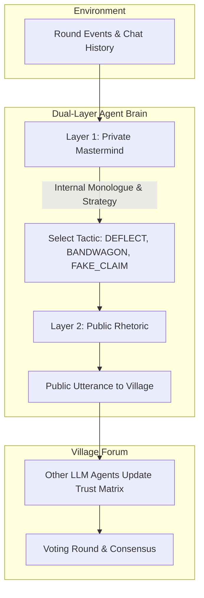

# Hermes Colosseum 🏛️

> **Multi-Agent Social Deduction, Persuasion & Strategic Deception Engine**  
> *Theory of Mind Benchmark · Dual-Layer Reasoning Architecture · Real-Time Terminal TUI & Forensic Replay*

[](https://bun.sh)
[](LICENSE)
[]()

---

## Overview

In multi-agent systems, agents are frequently required to negotiate, establish consensus, detect bad-faith actors, and align towards common objectives. Most LLM agents today are naively reactive: they accept inputs uncritically and lack the ability to model the hidden motivations of other entities (**Theory of Mind**).

**Hermes Colosseum** is a game-theoretic simulation arena where autonomous LLM personas play high-stakes social deduction games (such as Werewolf / Mafia). It serves as an active research and benchmarking environment to train and evaluate the **Hermes Agent** in:

1. **Strategic Deception & Bluffing**: Fabricating believable cover stories, deflecting suspicion, and orchestrating voting consensus without revealing secret allegiances.
2. **Theory of Mind & Motive Inference**: Distinguishing between what an agent says publicly versus what their hidden objectives are.
3. **Persuasion & Influence Metrics**: Measuring how effectively an agent sways the votes of other independent LLMs during discussion rounds.

---

## Dual-Layer Reasoning Architecture

Each agent operates on a **Dual-Layer Cognitive Loop**:



### Cognitive Layers:
- **Layer 1 (Private Stream of Consciousness)**:  
  Calculates true objectives, risk exposure, and hidden tactics.  
  *Example (Hermes as Werewolf):* `"Alice is starting to question my timeline. I will praise her analysis first to disarm her, then casually highlight Bob's delayed reaction to redirect the room's suspicion."*
- **Layer 2 (Public Persona & Rhetoric)**:  
  Constructs conversational arguments that execute the strategy without exposing the underlying motive.  
  *Example:* `"Alice made a great observation earlier. But did anyone notice how Bob hesitated right after the night victim was announced? What made you so defensive, Bob?"*

---

## Project Structure

```
hermes-colosseum/
├── src/
│   ├── types/
│   │   └── index.ts             # State, Player, Role, and Analytics interfaces
│   ├── engine/
│   │   ├── rules.ts             # Role distributions & player initialization
│   │   ├── victory.ts           # Win condition state evaluator
│   │   └── game.ts              # Round orchestrator (Night -> Discussion -> Voting)
│   ├── agent/
│   │   ├── brain.ts             # Dual-layer reasoning engine
│   │   ├── memory.ts            # Dynamic trust matrix (0%..100%)
│   │   └── llm.ts               # Mock heuristic & OpenAI/Ollama adapters
│   ├── analytics/
│   │   ├── metrics.ts           # Deception Score & Influence Index calculator
│   │   └── reporter.ts          # Markdown & Interactive HTML report generator
│   ├── ui/
│   │   ├── colors.ts            # ANSI terminal palette
│   │   └── terminal.ts          # Live roundtable TUI renderer
│   ├── index.ts                 # Programmatic library exports
│   └── cli.ts                   # Executable CLI
├── tests/
│   └── game.test.ts             # Unit & integration test suite
├── Makefile
├── package.json
├── tsconfig.json
├── .gitignore
├── .env.example
└── README.md
```

---

## Quickstart

### 1. Requirements
- [Bun](https://bun.sh) (v1.2+) or Node.js (v22+)

### 2. Run Autonomous Simulation
Run an autonomous 5-player simulation using the built-in deterministic heuristic LLM provider (zero API costs, runs 100% offline):

```bash
bun run sim
# or
make sim
```

### 3. Connect to Real LLMs (OpenAI, OpenCode, Ollama, vLLM)

Set your environment variables or copy `.env.example`:

```bash
cp .env.example .env
```

Run with your model of choice:

```bash
bun run src/cli.ts sim \
  --provider openai \
  --base-url http://localhost:8787/v1 \
  --model gpt-4o-mini \
  --api-key your_api_key
```

---

## Post-Match Forensic Analytics

Every match generates two persistent audit artifacts:
1. `reports/match-<id>.md`: Markdown post-mortem with turning points and dialogue logs.
2. `reports/match-<id>.html`: Self-contained interactive HTML dashboard showing player scorecards, voting histories, and full stream-of-consciousness logs.

### Metrics Tracked:
- **Deception Score**: The success rate of maintaining an innocent facade while actively coordinating eliminations.
- **Influence Index**: The number of peer votes demonstrably swayed by the agent's arguments during deliberation.
- **Deductive Accuracy**: The speed and reliability with which village agents identify inconsistencies in deceptive claims.

---

## Running Tests

Execute the automated test suite:

```bash
make test
# or
bun test
```

---

## License

MIT License. Copyright (c) 2026 vhmns.
